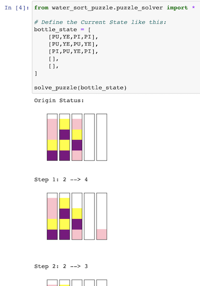

| [English](./README.md) |  [简体中文](./README-cn.md) |

# Water Sort Puzzle Solver

A visible solver to water sort puzzle base on python.

To get this game: [App Store](https://apps.apple.com/app/id1514542157) | [Google Play](https://play.google.com/store/apps/details?id=com.gma.water.sort.puzzle)

## Quick Start

[](https://mybinder.org/v2/gh/wjfjfm/water_sort_puzzle/HEAD?filepath=water-sort-puzzle-solver.ipynb)

Click **[HERE](https://mybinder.org/v2/gh/wjfjfm/water_sort_puzzle/HEAD?filepath=water-sort-puzzle-solver.ipynb)** and wait for 1 minute to get into an online environment for free!

After get into this ↑ environment

Use **Shift + Enter** to execute this block to get the Solver's result



Finally you can get the results!


## More Details

We define the state of current by these Label of colors:


Then you can define a status like this:

```python
bottle_state = [
    [PU,YE,PI,PI],
    [PU,YE,PU,YE],
    [PI,PU,YE,PI],
    [],
    [], 
]
```

Then let the Solver to give you the solutions:

```python
solve_puzzle(bottle_state)
```

You can customize the process and outputs by rewriting this function:

Or if you can ignore this if you don't understand it

```python
def solve_puzzle(bottle_state):
    
    pvb = PlotableVialBoard(bottle_state)  # Initialize
    solved_pvb = solve(pvb)  # Solve puzzle
    paths = solved_pvb.path  # Save Solution

    # Print out Solution:
    new_pvb = pvb.clone()

    print('Origin Status:')
    new_pvb.show()

    for n, path in enumerate(paths):
        print('Step %d: %d --> %d' % (n+1, path[0]+1, path[1]+1))
        new_pvb.move(*path)
        new_pvb.show()
        print()
```

## Use on Native Mechines

Download:

```bash
git clone https://github.com/wjfjfm/water_sort_puzzle.git
```

Install jupyter notebook (Skip this if you already installed):

```bash
pip install jupyter
```

Use jupyter notebook to to open this page

```bash
cd water_sort_puzzle && jupyter notebook water-sort-puzzle-solver.ipynb
```


